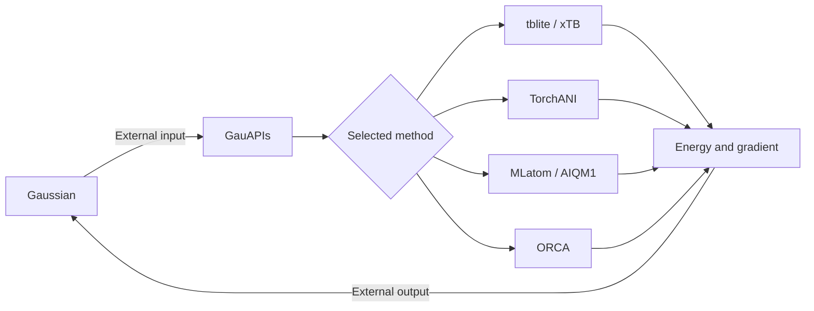

# GauAPIs

**A lightweight Python bridge between Gaussian's `External` interface and external quantum-chemistry or machine-learning calculators.**

GauAPIs reads the molecular geometry and derivative request generated by Gaussian, dispatches the calculation to a selected backend, and writes the resulting energy and Cartesian gradient back in Gaussian's external-program format. It was developed to combine Gaussian/ONIOM workflows with lower-cost electronic-structure and machine-learning methods through one command-line interface.

> **Project status:** research prototype developed and tested in a Linux/HPC environment. See [Current scope and limitations](#current-scope-and-limitations) before using it for production calculations.

## Features

- Connects directly to Gaussian through the `External` keyword.
- Provides a common interface to xTB, ANI, AIQM1, and ORCA calculations.
- Supports energy and first-derivative requests.
- Can assign different external methods to different ONIOM layers.
- Installs a `GauAPIs` command-line entry point.

## Supported backends

| Backend | Methods accepted by `-m` | Python package or executable | Current interface |
| --- | --- | --- | --- |
| [tblite](https://tblite.readthedocs.io/) | `gfn1-xtb`, `gfn2-xtb`, `xtb` | `tblite` | Python API |
| [TorchANI](https://aiqm.github.io/torchani/) | `ani-1x`, `ani-1ccx`, `ani-2x` | `torchani` and `torch` | Python API |
| [MLatom](https://aitomistic.com/mlatom/) | `aiqm1`, `aiqm1@dft` | `mlatom` and its method-specific dependencies | Python API |
| [ORCA](https://www.faccts.de/orca/) | Any other method string, such as `b3lyp` | `orca` executable | Generated input and parsed output |

The backend dependencies are optional and are not installed automatically by `setup.py`. Install only those required for your workflow.

## How it works



At runtime, GauAPIs:

1. Parses the atom count, derivative order, charge, multiplicity, atomic numbers, and coordinates from Gaussian's external input file.
2. Converts the geometry into a `Molecule` object.
3. Selects a calculator from the `-m/--method` argument.
4. Evaluates the energy and, when requested, the Cartesian gradient.
5. Writes the results to the external output file read by Gaussian.

## Installation

### 1. Clone the repository

```bash
git clone https://github.com/SamYToeL/APIs.git
cd APIs
```

### 2. Create an isolated Python environment

Using `venv`:

```bash
python -m venv .venv
source .venv/bin/activate
python -m pip install --upgrade pip
```

Using Conda:

```bash
conda create -n gauapis python
conda activate gauapis
```

### 3. Install GauAPIs

```bash
python -m pip install psutil
python -m pip install -e .
```

This installs the `GauAPIs` console command, NumPy, and the `psutil` module imported by the current implementation.

### 4. Install a calculator backend

For example, to use GFN-xTB through tblite:

```bash
python -m pip install tblite
```

Other backends must be installed according to their own documentation. ORCA must be installed separately and its executable must be available to the job environment.

Verify the command-line installation with:

```bash
GauAPIs --help
```

## Usage

### Gaussian with GFN2-xTB

Specify GauAPIs in the Gaussian route section:

```text
%nprocshared=4
%mem=4GB
# opt External='GauAPIs -m gfn2-xtb -n 4'

GFN2-xTB geometry optimization through GauAPIs

0 1
O   0.000000   0.000000   0.117790
H   0.000000   0.755453  -0.471161
H   0.000000  -0.755453  -0.471161

```

Then run Gaussian normally, for example:

```bash
g16 water.gjf > water.log
```

Gaussian appends its external-file arguments to the quoted command. GauAPIs receives those positional arguments, calls tblite, and returns the energy and gradient to Gaussian.

### ONIOM with two external methods

Different GauAPIs methods can be assigned to the two ONIOM layers:

```text
# opt=nomicro \
  oniom(external='GauAPIs -m AIQM1':external='GauAPIs -m gfn2-xtb -n 4') \
  nosymm
```

A larger ONIOM input is available in [`example/1aid_ligand_aiqm1.gjf`](example/1aid_ligand_aiqm1.gjf).

### Command-line options

| Option | Meaning | Example |
| --- | --- | --- |
| `-m`, `--method` | Calculator or model used for the external evaluation | `-m ani-2x` |
| `-n`, `--CPU` | Requested CPU count and thread configuration | `-n 4` |

The remaining positional arguments are supplied by Gaussian and normally should not be entered manually:

```text
layer infile outfile Msg FChk MatE
```

## Repository structure

```text
APIs/
├── GauAPIs/
│   ├── Molecule.py          # Molecular data container
│   ├── New_Calculator.py    # Backend-specific calculator adapters
│   └── main.py              # Gaussian I/O and command-line dispatch
├── example/                 # Example inputs and reference outputs
├── setup.py                 # Package metadata and console entry point
├── LICENSE.txt
└── README.md
```

## Current scope and limitations

- GauAPIs currently supports energies and first Cartesian derivatives; Hessians and other higher-order properties are not implemented.
- The repository reflects the original Linux/HPC deployment and contains site-specific environment paths that may need to be replaced for another machine.
- The ORCA adapter currently generates an `ENGRAD` calculation with the `DEF2-TZVPP` basis and treats an unrecognized `-m` value as an ORCA method.
- `setup.py` does not yet declare every runtime and optional dependency; backend packages and external executables must be installed separately.
- Energy and gradient conventions should be validated against an independent reference for each backend before scientific production use, especially after changing package versions.
- Automated unit and integration tests are not yet included.

## License

This project is distributed under the [MIT License](LICENSE.txt).
